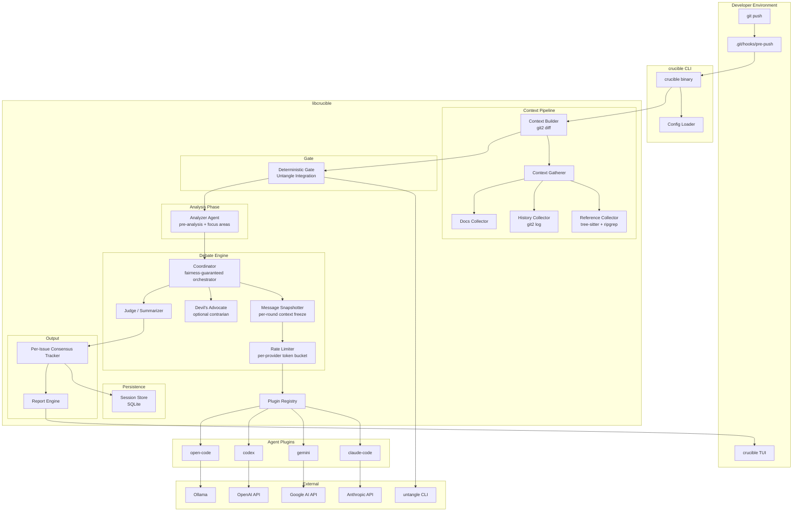
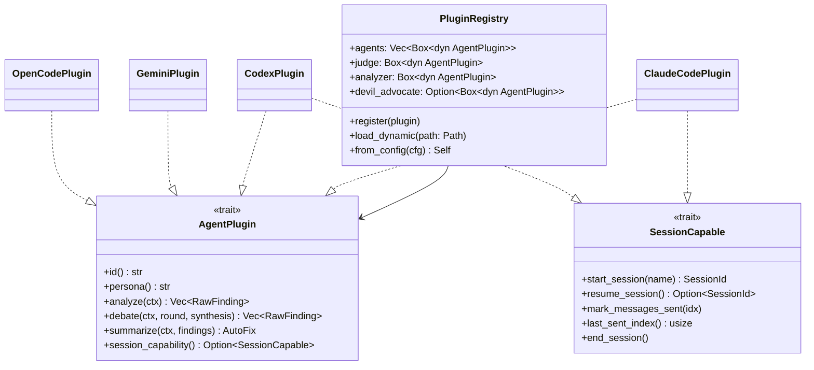
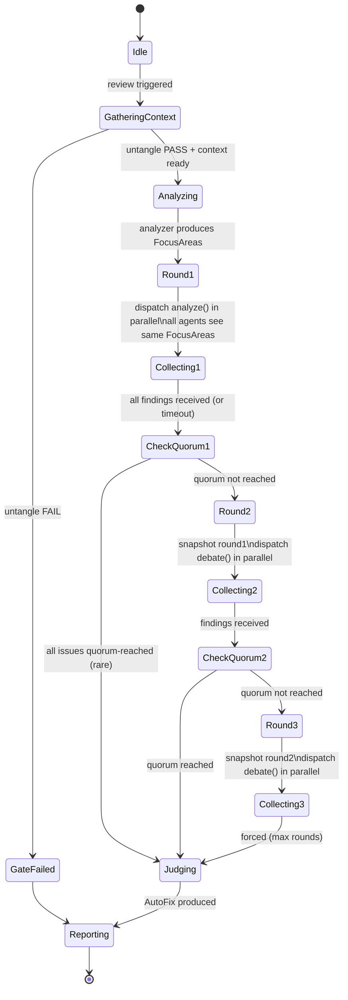
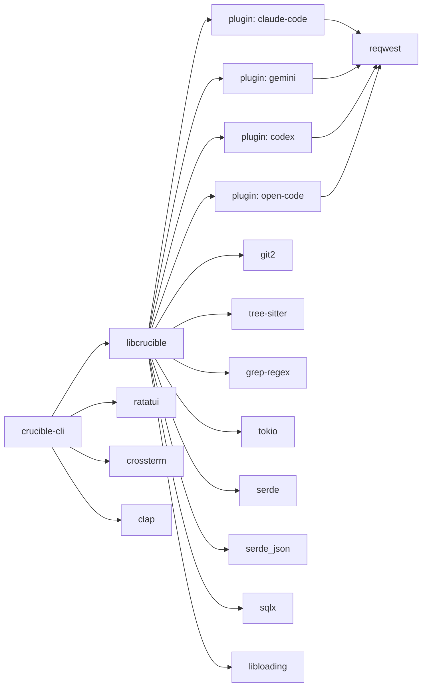

# Technology Architecture & Design: Crucible

**Version:** 0.2 (Updated with Magpie learnings)
**Status:** Proposal

---

## 1. Overview

This document describes the technical architecture of Crucible: a `libcrucible` core library, a `crucible` CLI tool, a pluggable agent system, and the multi-agent coordinator. The primary deployment scenario is a **git pre-push hook** that intercepts commits before they reach a remote.

The system is written in **Rust**. The design incorporates lessons from the Magpie reference implementation (TypeScript) while fixing its known rough edges and exploiting Rust-specific advantages.

### Key improvements over prior art (Magpie)

| Problem in Magpie | Crucible solution |
|:---|:---|
| Brittle JSON extraction with 3-retry fallback | Structured outputs via JSON schema in system prompt + strongly-typed parsing |
| All-or-nothing convergence detection | Per-issue consensus tracking clustered by (file, span) |
| Session management spread across providers | `SessionCapable` trait as a formal Rust capability, not optional duck-typing |
| Context rebuilt each round for non-session providers | Explicit message pruning strategy + token budget per round |
| No partial result saving on crash | SQLite-backed session log; debate is resumable |
| Single-phase analysis (all reviewers, same info) | Pre-analysis phase: Analyzer runs first, extracts focus areas, then Debaters receive focused context |
| Consensus requires ALL reviewers to agree | Configurable quorum: default 75% of debaters per cluster |
| Context gathering via regex (imprecise symbols) | `tree-sitter` for precise symbol extraction, ripgrep for reference tracing |
| No rate limiting (parallel blasts all APIs) | Per-provider token-bucket rate limiter |
| Reviewer personas only in prompt text | Personas as first-class config with `role_weights` (e.g., security findings weighted 2x in verdict) |

---

## 2. High-Level Component Map



---

## 3. Repository Layout

```
crucible/
├── Cargo.toml                      # workspace root
├── crates/
│   ├── libcrucible/                # core library
│   │   ├── src/
│   │   │   ├── lib.rs
│   │   │   ├── config.rs           # CrucibleConfig, loader, validation
│   │   │   ├── context/
│   │   │   │   ├── mod.rs          # ReviewContext, from_push, from_diff
│   │   │   │   ├── gatherer.rs     # Context gathering pipeline
│   │   │   │   ├── reference.rs    # tree-sitter symbol extraction + ripgrep
│   │   │   │   ├── history.rs      # git2 commit log for affected files
│   │   │   │   └── docs.rs         # markdown/doc file collector
│   │   │   ├── gate.rs             # Untangle deterministic gate
│   │   │   ├── analysis.rs         # Pre-analysis phase (Analyzer agent)
│   │   │   ├── coordinator/
│   │   │   │   ├── mod.rs          # Coordinator, round management
│   │   │   │   ├── snapshot.rs     # Per-round message snapshotter
│   │   │   │   ├── consensus.rs    # Per-issue clustering + quorum
│   │   │   │   └── synthesis.rs    # Cross-pollination prompt builder
│   │   │   ├── plugin.rs           # AgentPlugin + SessionCapable traits
│   │   │   ├── rate_limit.rs       # Per-provider token bucket
│   │   │   ├── session.rs          # SQLite-backed session persistence
│   │   │   ├── judge.rs            # Final summarization + AutoFix
│   │   │   └── report.rs           # ReviewReport, Finding, AutoFix
│   │   └── Cargo.toml
│   │
│   ├── crucible-cli/               # thin CLI wrapper
│   │   ├── src/
│   │   │   ├── main.rs
│   │   │   ├── commands/
│   │   │   │   ├── review.rs
│   │   │   │   ├── hook.rs
│   │   │   │   ├── session.rs      # list / resume sessions
│   │   │   │   └── config.rs
│   │   │   └── tui/
│   │   │       ├── mod.rs
│   │   │       ├── running.rs      # per-agent spinner state
│   │   │       ├── review.rs       # findings list + action prompt
│   │   │       ├── diff.rs         # scrollable diff overlay
│   │   │       └── chat.rs         # interactive chat with Judge
│   │   └── Cargo.toml
│   │
│   └── plugins/
│       ├── claude-code/
│       ├── gemini/
│       ├── codex/
│       └── open-code/
│
├── docs/specs/
├── flake.nix
├── package.nix
└── .crucible.toml
```

---

## 4. Core Library: `libcrucible`

### 4.1 Public API

```rust
/// Primary entry point
pub async fn run_review(cfg: &CrucibleConfig) -> Result<ReviewReport>;

/// Resume an interrupted review
pub async fn resume_review(session_id: Uuid, cfg: &CrucibleConfig) -> Result<ReviewReport>;

pub struct ReviewReport {
    pub verdict:       Verdict,
    pub findings:      Vec<Finding>,       // all clustered + deduplicated
    pub consensus_map: ConsensusMap,       // per-(file,span) quorum status
    pub auto_fix:      Option<AutoFix>,
    pub transcript:    DebateTranscript,
    pub session_id:    Uuid,
}

pub struct Finding {
    pub agent:       String,
    pub severity:    Severity,
    pub file:        Option<PathBuf>,
    pub span:        Option<LineSpan>,
    pub message:     String,
    pub round:       u8,
    pub raised_by:   Vec<String>,         // merged: all agents who found this
}

pub struct ConsensusMap(HashMap<FindingKey, ConsensusStatus>);
pub struct FindingKey { pub file: PathBuf, pub span: LineSpan }
pub struct ConsensusStatus {
    pub agreed_count:  usize,
    pub total_agents:  usize,
    pub severity:      Severity,           // highest severity across agents
    pub reached_quorum: bool,
}

pub struct AutoFix {
    pub unified_diff: String,
    pub explanation:  String,
}

pub enum Verdict { Pass, Warn, Block }
pub enum Severity { Info, Warning, Critical }
```

---

## 5. Context Gathering Pipeline

Before any AI token is spent on debate, the pipeline collects rich context that is injected into every agent's prompt. This is run in parallel with the Untangle gate.

```mermaid
graph LR
    DIFF[git diff\ngit2] --> CTX

    subgraph Context Gatherer — parallel
        REF[Reference Tracer\ntree-sitter symbols → ripgrep usages]
        HIST[History Collector\ngit2 log for changed files]
        DOCS[Docs Collector\nREADME, ARCHITECTURE, inline docs]
    end

    CTX --> REF & HIST & DOCS
    REF & HIST & DOCS --> MERGED[GatheredContext]
    MERGED --> ANA[Analyzer Agent]
    ANA --> FOCUS[FocusAreas\nstructured JSON]
```

### 5.1 Reference Tracer

Uses `tree-sitter` to parse changed files and extract modified symbols (functions, structs, traits, classes). Then uses `ripgrep` as a library (`grep-regex`) to find all usages of those symbols across the repo.

```rust
pub struct ReferenceCollector;

impl ReferenceCollector {
    /// Extract symbols modified in the diff using tree-sitter
    pub fn extract_symbols(diff: &str, repo_root: &Path) -> Vec<Symbol>;
    /// Find all usages of each symbol in the repo
    pub fn trace_references(symbols: &[Symbol], repo_root: &Path) -> Vec<Reference>;
}

pub struct Symbol { pub name: String, pub kind: SymbolKind, pub file: PathBuf }
pub struct Reference { pub symbol: String, pub file: PathBuf, pub line: u32, pub snippet: String }
pub enum SymbolKind { Function, Struct, Trait, Impl, Constant }
```

### 5.2 History Collector

Retrieves the last N commits that touched any file in the diff using `git2`. Provides temporal context: what was this code doing before?

```rust
pub struct HistoryCollector { pub max_commits: usize, pub max_days: u32 }

impl HistoryCollector {
    pub fn collect(&self, changed_files: &[PathBuf], repo: &Repository) -> Vec<CommitSummary>;
}

pub struct CommitSummary {
    pub sha: String, pub message: String,
    pub author: String, pub date: DateTime<Utc>,
}
```

### 5.3 Docs Collector

Scans for `README.md`, `ARCHITECTURE.md`, `CONTRIBUTING.md`, and any `.md` files under `docs/`. Truncated to a configurable max bytes.

### 5.4 Pre-Analysis Phase

After context is gathered, an **Analyzer agent** runs before the main debate. It produces a structured `FocusAreas` object injected into every debater's prompt.

```rust
pub struct FocusAreas {
    pub summary:     String,              // what this diff does
    pub focus_items: Vec<FocusItem>,
    pub trade_offs:  Vec<String>,
}
pub struct FocusItem { pub area: String, pub rationale: String }
```

The Analyzer's system prompt:

```
You are a senior architect providing pre-review analysis.
Analyze the diff and context, then output ONLY valid JSON:
{
  "summary": "<what this change does in 2 sentences>",
  "focus_items": [
    { "area": "Security", "rationale": "The token parsing at auth.rs:47 is unvalidated" }
  ],
  "trade_offs": ["Adds latency for security gain"]
}

Focus items are SUGGESTIONS — debaters should also flag anything else they notice.
```

Crucially, focus areas are injected into debater prompts **without revealing which model produced them**, preventing authority bias.

---

## 6. Plugin System

### 6.1 The `AgentPlugin` Trait

```rust
#[async_trait]
pub trait AgentPlugin: Send + Sync {
    fn id(&self)      -> &str;
    fn persona(&self) -> &str;

    /// Round 1: independent analysis
    async fn analyze(&self, ctx: &AgentContext) -> Result<Vec<RawFinding>>;

    /// Round 2+: respond to cross-pollinated synthesis
    async fn debate(
        &self,
        ctx:      &AgentContext,
        round:    u8,
        synthesis: &CrossPollinationSynthesis,
    ) -> Result<Vec<RawFinding>>;

    /// Judge only: produce final unified diff
    async fn summarize(
        &self,
        ctx:      &AgentContext,
        findings: &[Finding],
    ) -> Result<AutoFix>;

    /// Optional: does this plugin support persistent sessions?
    fn session_capability(&self) -> Option<&dyn SessionCapable> { None }
}
```

### 6.2 The `SessionCapable` Trait

Session support is a formal Rust capability, not duck-typed optional methods. This makes the coordinator's token-optimization logic explicit and type-safe.

```rust
pub trait SessionCapable {
    fn start_session(&mut self, name: &str) -> Result<SessionId>;
    fn resume_session(&self) -> Option<SessionId>;
    fn mark_messages_sent(&mut self, up_to_index: usize);
    fn last_sent_index(&self) -> usize;
    fn end_session(&mut self);
}
```

For session-capable plugins, the coordinator only sends messages **after** `last_sent_index` on rounds 2+. For non-session plugins, the coordinator automatically applies message pruning (removes round-1 verbatim findings, keeps only their summaries) to stay within token budgets.

### 6.3 Structured Output Contract

Every plugin's `analyze` and `debate` methods must produce `Vec<RawFinding>` by parsing a JSON-schema-constrained response. The schema is embedded in the system prompt:

```
Respond ONLY with valid JSON matching this schema exactly:
{
  "findings": [
    {
      "severity": "Critical | Warning | Info",
      "file": "<relative path or null>",
      "line_start": <integer or null>,
      "line_end": <integer or null>,
      "message": "<concise, actionable description>",
      "confidence": "High | Medium | Low"
    }
  ]
}

Do not include explanation outside the JSON object.
```

For Claude, we additionally set `"type": "json_object"` in the API request. This eliminates the retry-on-parse-failure pattern entirely.

### 6.4 Plugin Registry



### 6.5 First-Party Plugins

| Plugin ID | Default Persona | Role Weight | Backend | Session |
|:---|:---|:---|:---|:---|
| `claude-code` | Security Auditor | 2.0× (security findings) | Anthropic API | Yes |
| `gemini` | Performance Optimizer | 1.5× (perf findings) | Google AI API | No |
| `codex` | Architecture Lead | 1.5× (architecture) | OpenAI API | Yes |
| `open-code` | Correctness Reviewer | 1.0× (baseline) | Ollama | No |

`role_weight` biases the verdict: a Critical finding from the Security Auditor counts more toward a `Block` verdict than an Info finding from the Correctness Reviewer. Weights are configurable in `.crucible.toml`.

### 6.6 Devil's Advocate Agent (Optional)

An optional fifth agent with a `challenge_majority` directive. In rounds 2+, after other agents' round-1 findings are synthesized, the Devil's Advocate is given the synthesis and instructed to argue against the current consensus. This prevents premature convergence.

```
[Devil's Advocate Directive]
Other reviewers have converged on the following consensus. Your job is NOT to agree.
Find the strongest counterarguments. Where is the consensus wrong or incomplete?
What risks are being ignored because all reviewers are biased toward the same framing?
```

The Devil's Advocate's findings are included in the consensus computation but are downweighted (0.5× default) to avoid artificially blocking all convergence.

### 6.7 Dynamic Plugin Loading

Third-party plugins are `.so`/`.dylib` files exporting:

```rust
#[no_mangle]
pub extern "C" fn crucible_plugin_init() -> *mut dyn AgentPlugin { ... }
```

Discovered from `plugins.paths` in `.crucible.toml`.

---

## 7. The Coordinator

### 7.1 The Fairness Guarantee

The most critical invariant: **all same-round debaters receive identical historical context before any of them executes**. This is enforced via a `MessageSnapshotter`.

```rust
pub struct MessageSnapshotter {
    rounds: Vec<RoundSnapshot>,
}

pub struct RoundSnapshot {
    pub round:    u8,
    pub messages: HashMap<AgentId, Vec<AgentMessage>>, // frozen at round start
}

impl MessageSnapshotter {
    /// Called BEFORE dispatching round N — takes a snapshot of all round N-1 output.
    /// No debater in round N can see round N output from a peer.
    pub fn freeze_round(&mut self, round: u8, messages: &HashMap<AgentId, Vec<AgentMessage>>);
    pub fn get_snapshot(&self, round: u8) -> Option<&RoundSnapshot>;
}
```

### 7.2 State Machine



### 7.3 Cross-Pollination Synthesis

Before each debate round, the coordinator assembles a synthesis from the prior round's findings:

1. **Cluster findings** by `(file, overlapping_span)` using span-overlap detection.
2. **Anonymize**: strip agent identity. Agents see only "N reviewers flagged X", not "Claude flagged X".
3. **Summarize per cluster** so the synthesis is concise even with many agents.
4. **Tag disagreements**: where agents differ on severity, explicitly flag the disagreement.

```
[Synthesis – Round 1 Results — AGENT IDENTITIES REDACTED]

Cluster A: auth.rs:43-51 — 3 of 4 agents flag Critical
  Dominant finding: "Potential null dereference on token unwrap without bounds check"
  Minority finding: "Warning only — this path is guarded by the outer if-let"
  → Disagreement: Is this Critical or Warning? Justify with evidence.

Cluster B: parser.rs:120 — 2 of 4 agents flag Warning
  Finding: "O(n²) loop may degrade at scale"
  → 2 agents did not mention this. Do you agree? Why or why not?

Cluster C: auth.rs:12 — 1 of 4 agents flags Info
  Finding: "Unused import std::fmt"
  → Not yet corroborated.

Your task: Re-evaluate your analysis in light of these findings.
Confirm, escalate, rebut, or surface NEW issues you missed.
```

### 7.4 Per-Issue Consensus Tracking

Instead of all-or-nothing convergence, Crucible tracks consensus **per issue cluster**:

```rust
pub struct ConsensusTracker {
    clusters: HashMap<FindingKey, ClusterState>,
    quorum:   f32,   // default 0.75
    agents:   usize,
}

impl ConsensusTracker {
    pub fn ingest_round(&mut self, findings: &[RawFinding], round: u8);
    pub fn quorum_reached_for(&self, key: &FindingKey) -> bool;
    pub fn all_quorum_reached(&self) -> bool;
    /// Issues that have quorum can be sent to the Judge for partial AutoFix
    pub fn quorum_issues(&self) -> Vec<Finding>;
}
```

Clustering algorithm:
1. Two findings are in the same cluster if they share the same `file` and their `line_start..line_end` ranges overlap by ≥ 50%.
2. Semantic similarity (Jaccard on tokenized messages, stop-words removed) ≥ 0.35 also merges findings regardless of span, catching the same conceptual issue reported at slightly different locations.

Early termination: if all issue clusters reach quorum before `max_rounds`, the coordinator skips to the Judge phase. This saves tokens on easy diffs.

### 7.5 Rate Limiter

```rust
pub struct ProviderRateLimiter {
    limiters: HashMap<String, TokenBucket>,
}

pub struct TokenBucket {
    capacity:   u32,       // max burst
    refill_rate: u32,      // tokens/second
    current:    AtomicU32,
}
```

Default limits (configurable):

| Provider | Requests/min | Burst |
|:---|:---|:---|
| Anthropic | 50 | 5 |
| Google AI | 60 | 10 |
| OpenAI | 60 | 10 |
| Ollama (local) | unlimited | — |

---

## 8. Session Persistence

Reviews can be long. If the coordinator crashes mid-debate (network error, user Ctrl-C), the session is resumable.

```rust
pub struct SessionStore {
    conn: SqliteConnection,
}

impl SessionStore {
    pub fn create_session(&self, ctx: &ReviewContext) -> Result<Uuid>;
    pub fn commit_round(&self, id: Uuid, round: u8, findings: &[RawFinding]) -> Result<()>;
    pub fn load_session(&self, id: Uuid) -> Result<SessionState>;
    pub fn mark_complete(&self, id: Uuid, report: &ReviewReport) -> Result<()>;
    pub fn list_sessions(&self) -> Result<Vec<SessionSummary>>;
}
```

Schema:

```sql
CREATE TABLE sessions (
    id TEXT PRIMARY KEY,
    repo_root TEXT NOT NULL,
    base_ref TEXT NOT NULL,
    head_ref TEXT NOT NULL,
    created_at DATETIME DEFAULT CURRENT_TIMESTAMP,
    completed_at DATETIME,
    verdict TEXT
);

CREATE TABLE round_findings (
    session_id TEXT REFERENCES sessions(id),
    round INTEGER NOT NULL,
    agent_id TEXT NOT NULL,
    finding_json TEXT NOT NULL  -- serialized RawFinding
);
```

Sessions are stored in `~/.local/share/crucible/sessions.db`. The CLI exposes `crucible session list` and `crucible session resume <id>`.

---

## 9. CLI Tool: `crucible`

### 9.1 Commands

```
crucible review [--hook] [--json] [--resume <session-id>]
    Run a full review of the current git diff.
    --hook    Exit 1 to block push on Block verdict
    --json    Emit ReviewReport as JSON
    --resume  Resume an interrupted session

crucible hook install [--force]
crucible hook uninstall
crucible hook status

crucible session list
crucible session resume <id>
crucible session delete <id>

crucible config init
crucible config validate
```

### 9.2 TUI Layout

```
┌─ Crucible ──────────── auth.rs + 2 files ── Round 2/3 ─────────────────────┐
│                                                                              │
│  Analysis Phase       ████████████████████ done  (FocusAreas: 3 items)      │
│  ─────────────────────────────────────────────────────────────────────────  │
│  ● Security Auditor   (claude-code)   ████████████ done  [4 findings]        │
│  ⠸ Performance Optim  (gemini)        ██████░░░░░░ analyzing…               │
│  ○ Architecture Lead  (codex)         ░░░░░░░░░░░░ queued                   │
│  ○ Devil's Advocate   (open-code)     ░░░░░░░░░░░░ queued                   │
│                                                                              │
│  ─────────────────────────────────────────────────────────────────────────  │
│  FINDINGS  [clustered by location]                    Quorum: 2/4 reached   │
│                                                                              │
│  ✓ [CRITICAL] auth.rs:47   Null dereference on token  3/4 agree ← quorum   │
│  ⋯ [WARNING]  auth.rs:83   Missing error propagation  2/4 agree             │
│    [INFO]     auth.rs:12   Unused import               1/4 agree            │
│                                                                              │
│  ─────────────────────────────────────────────────────────────────────────  │
│  AUTO-FIX READY for 1 quorum issue.                                         │
│  [Enter] Apply    [D] View diff    [C] Chat with Judge    [Q] Skip/Quit      │
└──────────────────────────────────────────────────────────────────────────────┘
```

### 9.3 Chat with Judge

Pressing `[C]` opens an inline chat session with the Judge agent. The developer can ask questions, request explanations, or tweak the proposed fix before accepting.

```
┌─ Chat with Judge ────────────────────────────────────────────────────────────┐
│  Judge: I've identified a null dereference at auth.rs:47 where `token`      │
│  is unwrapped without checking if the refresh succeeded. The fix adds an    │
│  explicit `ok_or_else` with a typed `AuthError::TokenRefreshFailed`.        │
│                                                                              │
│  > Why didn't you fix the warning at auth.rs:83 too?                        │
│                                                                              │
│  Judge: The Performance and Correctness agents disagreed on the right        │
│  approach at auth.rs:83. I only auto-fix issues with quorum. You can        │
│  apply the Critical fix now and address auth.rs:83 manually.                │
│                                                                              │
│  > OK, apply the Critical fix.                                               │
│  [Esc] Close chat                                                            │
└──────────────────────────────────────────────────────────────────────────────┘
```

---

## 10. Git Pre-Push Hook: End-to-End Flow

```mermaid
sequenceDiagram
    actor Dev as Developer
    participant Git as git push
    participant Hook as pre-push hook
    participant CLI as crucible CLI
    participant Pipe as Context Pipeline
    participant Gate as Untangle Gate
    participant Ana as Analyzer Agent
    participant Coord as Coordinator
    participant Snap as Snapshotter
    participant Agents as Debater Council (parallel)
    participant Devil as Devil's Advocate
    participant Judge as Judge Agent
    participant TUI as TUI

    Dev->>Git: git push origin main
    Git->>Hook: invoke pre-push
    Hook->>CLI: crucible review --hook
    CLI->>Pipe: collect diff + references + history + docs

    par Context gathering in parallel
        Pipe->>Pipe: tree-sitter symbol extraction
        Pipe->>Pipe: ripgrep reference trace
        Pipe->>Pipe: git2 history for changed files
        Pipe->>Pipe: docs collection
    and Gate check in parallel
        CLI->>Gate: untangle diff HEAD~1..HEAD
    end

    Gate-->>CLI: dependency graph (or GateFailed)

    alt Untangle FAIL
        CLI-->>TUI: architectural debt error
        TUI-->>Dev: blocked — circular dependency
        CLI-->>Hook: exit(1)
    end

    CLI->>Ana: analyze(ctx + gathered_context)
    Ana-->>CLI: FocusAreas { summary, focus_items, trade_offs }

    Note over Coord,Agents: Round 1 — Snapshot empty; all agents see FocusAreas only
    Snap->>Snap: freeze_round(1, empty)
    par Parallel Round 1
        Coord->>Agents: analyze(ctx + FocusAreas) → claude-code
        Coord->>Agents: analyze(ctx + FocusAreas) → gemini
        Coord->>Agents: analyze(ctx + FocusAreas) → codex
        Coord->>Agents: analyze(ctx + FocusAreas) → open-code
    end
    Agents-->>Coord: RawFindings × 4
    Coord->>Coord: cluster + check quorum

    Note over Coord,Agents: Round 2 — Snapshot round 1; anonymized synthesis
    Snap->>Snap: freeze_round(2, round1_findings)
    Coord->>Coord: build CrossPollinationSynthesis (anonymized)
    par Parallel Round 2
        Coord->>Agents: debate(ctx, round=2, synthesis)
        Coord->>Devil: debate(ctx, round=2, synthesis) [challenge majority]
    end
    Agents-->>Coord: RawFindings × 4
    Coord->>Coord: cluster + check quorum → converged

    Coord->>Judge: summarize(ctx, quorum_findings)
    Judge-->>Coord: AutoFix { unified_diff, explanation }
    Coord->>Coord: persist session to SQLite

    Coord-->>CLI: ReviewReport { verdict=Warn, findings, auto_fix, consensus_map }
    CLI-->>TUI: render

    alt Dev accepts fix
        Dev->>TUI: Enter
        TUI->>CLI: git apply unified_diff
        CLI-->>Hook: exit(0)
        Hook-->>Git: push proceeds
    else Dev chats with Judge
        Dev->>TUI: C
        TUI->>CLI: open Judge chat
        Dev->>CLI: accepts after discussion
        CLI-->>Hook: exit(0)
    else Verdict is Block
        CLI-->>Hook: exit(1)
        Hook-->>Git: push aborted
    end
```

---

## 11. Configuration: `.crucible.toml`

```toml
[crucible]
version = "1"

[gate]
enabled     = true
untangle_bin = "untangle"

[context]
# Reference tracing
reference_max_depth      = 2
reference_max_files      = 30
# History
history_max_commits      = 20
history_max_days         = 30
# Docs
docs_patterns            = ["docs/**/*.md", "README.md", "ARCHITECTURE.md"]
docs_max_bytes           = 50_000

[coordinator]
max_rounds           = 3
quorum_threshold     = 0.75   # 75% of agents must agree per cluster
agent_timeout_secs   = 90
devil_advocate       = false  # enable optional contrarian agent

[verdict]
block_on = "Critical"         # Critical | Warning | never

[rate_limits]
anthropic_rpm  = 50
google_rpm     = 60
openai_rpm     = 60

[plugins]
agents = ["claude-code", "gemini", "codex", "open-code"]
judge  = "claude-code"
analyzer = "claude-code"
paths  = []              # third-party .so/.dylib paths

[plugins.claude-code]
api_key_env  = "ANTHROPIC_API_KEY"
model        = "claude-opus-4-6"
persona      = "Security Auditor"
role_weight  = 2.0

[plugins.gemini]
api_key_env  = "GEMINI_API_KEY"
model        = "gemini-2.0-flash"
persona      = "Performance Optimizer"
role_weight  = 1.5

[plugins.codex]
api_key_env  = "OPENAI_API_KEY"
model        = "gpt-4o"
persona      = "Architecture Lead"
role_weight  = 1.5

[plugins.open-code]
base_url     = "http://localhost:11434"
model        = "qwen2.5-coder"
persona      = "Correctness Reviewer"
role_weight  = 1.0
```

---

## 12. Key Design Decisions

### 12.1 Why Rust?

- The coordinator's fairness guarantee (snapshot before dispatch) maps naturally onto Rust ownership: once `freeze_round()` consumes the mutable map, no agent can retroactively see a peer's output from the same round.
- `tokio::sync::mpsc` channels provide type-safe backpressure between the coordinator and the TUI.
- `SessionCapable` as a Rust trait makes session optimization an explicit contract, not implicit duck-typing.
- Single binary via static compilation; no runtime dependency on Node.js or Python.

### 12.2 Structured Outputs Over Free-Text Parsing

Magpie retries JSON extraction up to 3 times and silently falls back to empty findings on failure. Crucible avoids this entirely:
- The JSON schema is embedded in the system prompt as a hard constraint.
- Claude is called with `"type": "json_object"` response format when available.
- `serde_json` deserialization errors are surfaced to the user as explicit plugin errors, not swallowed.

### 12.3 Per-Issue Consensus vs. All-or-Nothing

All-or-nothing convergence forces the full debate to continue even when 3 of 4 issues are settled and only one remains contested. Per-issue clustering lets the Judge auto-fix settled issues early while debate continues on contested ones. This reduces total token spend and gives the developer earlier, more granular feedback.

### 12.4 Pre-Analysis as Context Leveler

Without a pre-analysis phase, each debater independently figures out what the diff is doing—wasting tokens and risking divergent framings. The Analyzer runs once, establishes shared ground truth about what the diff does, and injects focus areas into all debater prompts. This is more token-efficient and produces more substantive debate.

### 12.5 Anonymized Synthesis for Anti-Sycophancy

The cross-pollination synthesis strips agent identity before feeding it back into the debate. Agents see "3 reviewers flagged X" not "Claude flagged X." This prevents models from deferring to a perceived authority (e.g., a more capable model in the pool).

---

## 13. Full Dependency Graph



---

## 14. Future Considerations

- **CI mode:** `crucible review --ci` emits SARIF for GitHub Advanced Security / GitLab SAST, using `verdict=Block` as the CI gate.
- **IDE bridge:** Expose `ReviewReport` over a Unix domain socket so VS Code / Neovim plugins can render inline findings without re-running the analysis.
- **Agent memory:** Persist `DebateTranscript` per file path. Agents can reference historical decisions ("This pattern was reviewed and approved in session abc123").
- **Prompt templates:** Ship built-in role templates (e.g., `--role=security-audit`, `--role=perf-review`) to lower the config burden for new users.
- **Diff chunking:** For very large diffs (> N tokens), automatically partition by file and run parallel sub-reviews, then merge `ConsensusMap` results.
