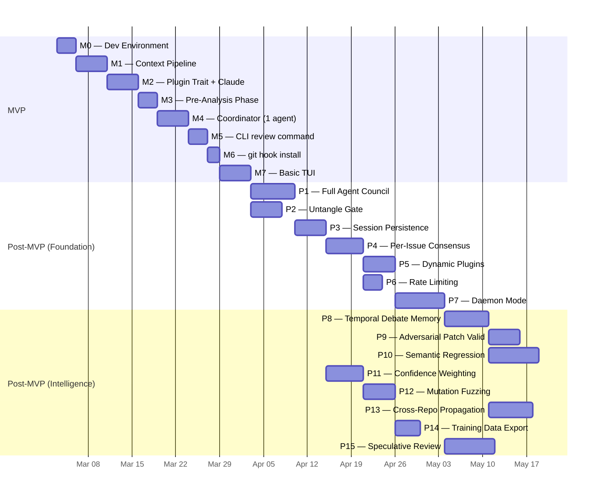
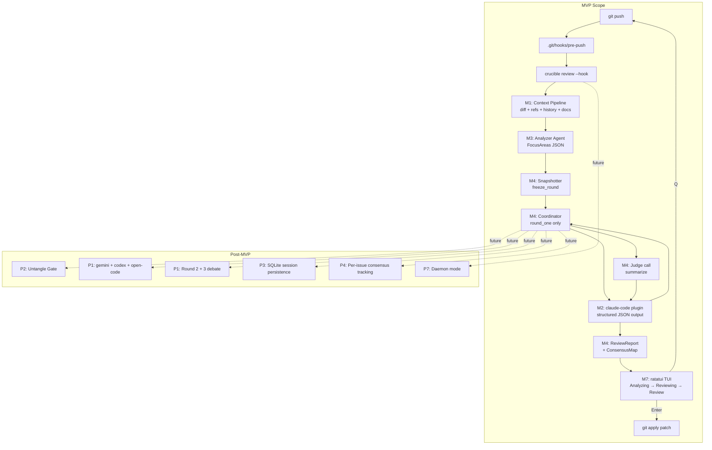

# Crucible Roadmap

**Last updated:** 2026-03-03

---

## Phases at a Glance



---

## MVP Definition

The MVP answers one question: **"Can Crucible intercept a git push, gather rich context, send the diff and context to one AI agent via a pre-analysis phase, and let the developer see and act on the result?"**

MVP deliberately excludes: multi-agent debate, Untangle integration, session persistence, per-issue consensus tracking, and dynamic plugin loading. The MVP proves the end-to-end pipe works and produces real value on day one.

### MVP Success Criteria

- [ ] `nix develop` gives a fully reproducible Rust build environment.
- [ ] `cargo build --release` produces a single `crucible` binary.
- [ ] `crucible hook install` writes a working `.git/hooks/pre-push`.
- [ ] On `git push`, the hook calls `crucible review --hook`, runs the Analyzer for pre-analysis, then calls the Claude agent with structured-output JSON and displays findings in the TUI.
- [ ] Findings are parsed from a guaranteed JSON schema response — no retry/fallback loop.
- [ ] Developer can press `[Q]` to skip or `[Enter]` to apply an auto-fix diff.
- [ ] `Critical` findings exit 1 (blocking the push); `Warning` exits 0 with a notice.

---

## M0 — Dev Environment

**Goal:** `nix develop` works. `cargo test` passes on a skeleton workspace.

### M0.1 — Nix flake

Create `flake.nix` following the forgemux pattern:

```nix
{
  inputs = {
    nixpkgs.url      = "github:NixOS/nixpkgs/nixos-unstable";
    rust-overlay.url = "github:oxalica/rust-overlay";
    rust-overlay.inputs.nixpkgs.follows = "nixpkgs";
    flake-utils.url  = "github:numtide/flake-utils";
  };

  outputs = { self, nixpkgs, rust-overlay, flake-utils }:
    flake-utils.lib.eachDefaultSystem (system:
      let
        pkgs = import nixpkgs {
          inherit system;
          overlays = [ rust-overlay.overlays.default ];
        };
        rustToolchain = pkgs.rust-bin.stable.latest.default.override {
          extensions = [ "clippy" "rustfmt" "rust-src" ];
        };
      in {
        devShells.default = pkgs.mkShell {
          buildInputs = [
            rustToolchain
            pkgs.pkg-config pkgs.cmake
            pkgs.openssl pkgs.libgit2
            pkgs.cargo-nextest pkgs.cargo-deny
            pkgs.cargo-llvm-cov pkgs.cargo-insta
            pkgs.mdbook pkgs.git
          ];
          LIBGIT2_NO_VENDOR   = "1";
          OPENSSL_DIR         = "${pkgs.openssl.dev}";
          OPENSSL_LIB_DIR     = "${pkgs.openssl.out}/lib";
          OPENSSL_INCLUDE_DIR = "${pkgs.openssl.dev}/include";
          shellHook = ''git config core.hooksPath .githooks'';
        };
      });
}
```

Files to create: `flake.nix`, `package.nix` (standalone derivation), `.githooks/pre-push` (placeholder).

### M0.2 — Cargo workspace skeleton

```toml
# Cargo.toml
[workspace]
members  = [
  "crates/libcrucible",
  "crates/crucible-cli",
  "crates/plugins/claude-code",
]
resolver = "2"

[workspace.package]
edition = "2024"
license = "MIT"

[workspace.dependencies]
anyhow             = "1"
thiserror          = "2"
serde              = { version = "1", features = ["derive"] }
serde_json         = "1"
toml               = "0.8"
tokio              = { version = "1", features = ["full"] }
reqwest            = { version = "0.12", features = ["json"] }
async-trait        = "0.1"
tracing            = "0.1"
tracing-subscriber = { version = "0.3", features = ["env-filter"] }
clap               = { version = "4", features = ["derive"] }
git2               = "0.19"
tree-sitter        = "0.24"
ratatui            = "0.29"
crossterm          = "0.28"
uuid               = { version = "1", features = ["v4"] }
tempfile           = "3"    # [dev]
wiremock           = "0.6"  # [dev]
```

Create stub `lib.rs` / `main.rs` files so `cargo test` compiles cleanly.

### M0.3 — CI skeleton

`.github/workflows/ci.yml`:
- `nix develop --command cargo nextest run`
- `nix develop --command cargo clippy -- -D warnings`
- `nix develop --command cargo fmt --check`

### M0.4 — `.githooks/pre-push` stub

```bash
#!/usr/bin/env bash
set -e
if command -v crucible &>/dev/null; then
  crucible review --hook
fi
```

**Deliverable:** `nix develop` opens a shell; `cargo build` compiles; CI green on stub code.

---

## M1 — Context Pipeline

**Goal:** `libcrucible` collects a rich `ReviewContext` — git diff, call-site references, commit history, and relevant docs — in parallel.

### M1.1 — `ReviewContext` type

```rust
pub struct ReviewContext {
    pub diff:           String,
    pub changed_files:  Vec<PathBuf>,
    pub base_ref:       String,
    pub head_ref:       String,
    pub repo_root:      PathBuf,
    pub gathered:       GatheredContext,
    pub dep_graph:      Option<String>,    // reserved for Untangle (P2)
}

pub struct GatheredContext {
    pub references:  Vec<Reference>,       // call-site usages of changed symbols
    pub history:     Vec<CommitSummary>,   // recent commits touching changed files
    pub docs:        Vec<DocSnippet>,      // relevant documentation
}
```

### M1.2 — Reference Tracer

Use `tree-sitter` (with the appropriate grammar for the repo's primary language) to extract modified function/struct/trait names from the diff. Then use `grep-regex` (ripgrep as a library) to find all files that reference those symbols.

```rust
pub fn extract_symbols(diff: &str, root: &Path) -> Vec<Symbol>;
pub fn trace_references(symbols: &[Symbol], root: &Path) -> Vec<Reference>;
```

For MVP: support Rust grammars. Post-MVP: add TypeScript, Python, Go grammars.

### M1.3 — History Collector

```rust
impl HistoryCollector {
    pub fn collect(&self, files: &[PathBuf], repo: &Repository) -> Vec<CommitSummary>;
}
```

Uses `git2` (not shelling out). Collects the last `history_max_commits` commits that touched any changed file.

### M1.4 — Docs Collector

Glob for `docs/**/*.md`, `README.md`, `ARCHITECTURE.md`. Truncate each to `docs_max_bytes`. Concatenate with file path headers.

### M1.5 — Config loading

```rust
pub struct CrucibleConfig { pub context: ContextConfig, pub coordinator: CoordinatorConfig, ... }
```

Searches upward from CWD for `.crucible.toml`, falls back to `~/.config/crucible/config.toml`. Environment variable expansion: `${ENV_VAR}`.

### M1.6 — Parallel assembly

All three collectors run via `tokio::join!` simultaneously with the gate check (gate is post-MVP but the join slot is reserved). Total context-gathering time ≈ max of the three, not their sum.

**Deliverable:** Unit tests for each collector using `tempfile` + `git2` fixture repos. Integration test asserting parallel execution via elapsed-time assertion.

---

## M2 — Plugin Trait & Claude-Code Plugin

**Goal:** Define `AgentPlugin` and `SessionCapable`; implement both for Claude. One agent receives a `ReviewContext` and returns structured `Vec<RawFinding>` — no retry loop, no fallback to empty.

### M2.1 — `AgentPlugin` and `SessionCapable` traits

```rust
#[async_trait]
pub trait AgentPlugin: Send + Sync {
    fn id(&self)      -> &str;
    fn persona(&self) -> &str;
    async fn analyze(&self, ctx: &AgentContext)                          -> Result<Vec<RawFinding>>;
    async fn debate(&self, ctx: &AgentContext, round: u8,
                    synthesis: &CrossPollinationSynthesis)               -> Result<Vec<RawFinding>>;
    async fn summarize(&self, ctx: &AgentContext, findings: &[Finding]) -> Result<AutoFix>;
    fn session_capability(&self) -> Option<&dyn SessionCapable>          { None }
}

pub trait SessionCapable {
    fn start_session(&mut self, name: &str)     -> Result<SessionId>;
    fn resume_session(&self)                     -> Option<SessionId>;
    fn mark_messages_sent(&mut self, idx: usize);
    fn last_sent_index(&self)                    -> usize;
    fn end_session(&mut self);
}
```

### M2.2 — Core types

```rust
pub struct RawFinding {
    pub severity:   Severity,
    pub file:       Option<PathBuf>,
    pub line_start: Option<u32>,
    pub line_end:   Option<u32>,
    pub message:    String,
    pub confidence: Confidence,
}
pub enum Severity   { Info, Warning, Critical }
pub enum Confidence { Low, Medium, High }
```

### M2.3 — `claude-code` plugin

System prompt template (embedded as `const`):

```
You are a {persona} performing a structured code review.

IMPORTANT: Respond ONLY with a valid JSON object matching this schema.
Do not include any text outside the JSON object.

{
  "findings": [
    {
      "severity":   "Critical | Warning | Info",
      "file":       "<relative path or null>",
      "line_start": <integer or null>,
      "line_end":   <integer or null>,
      "message":    "<concise, actionable description>",
      "confidence": "High | Medium | Low"
    }
  ]
}

Review context:
- Suggested focus areas: {focus_areas}
- Relevant references: {references}
- Recent commit history: {history}

Diff to review:
{diff}
```

The API call sets `"response_format": {"type": "json_object"}`. `serde_json::from_str` on the response — if it fails, return a typed `PluginError::MalformedResponse`, not an empty vec.

### M2.4 — Session support for `claude-code`

`ClaudeCodePlugin` implements both `AgentPlugin` and `SessionCapable`. On round 2+, the coordinator calls `last_sent_index()` and only sends messages from that index forward when resuming via `--resume <session_id>`.

### M2.5 — `PluginRegistry` (MVP-scoped)

```rust
pub struct PluginRegistry {
    pub agents:   Vec<Box<dyn AgentPlugin>>,
    pub judge:    Box<dyn AgentPlugin>,
    pub analyzer: Box<dyn AgentPlugin>,
}

impl PluginRegistry {
    pub fn from_config(cfg: &CrucibleConfig) -> Result<Self>;
}
```

For MVP, `from_config` wires up only `claude-code` for all roles.

### M2.6 — Mock plugin for tests

```rust
pub struct MockPlugin {
    pub id:       &'static str,
    pub responses: VecDeque<Vec<RawFinding>>,   // scripted responses per call
}
```

Unlike Magpie's echo mock, the `MockPlugin` returns a pre-programmed sequence. Tests can inject "3 Critical findings in round 1, 2 in round 2" to simulate realistic debate scenarios.

**Deliverable:** Unit tests with `MockPlugin`. Integration test with `wiremock` HTTP server validating JSON schema compliance of Claude API call. `cargo nextest run` green.

---

## M3 — Pre-Analysis Phase

**Goal:** Before the main debate, an Analyzer agent produces `FocusAreas` that are injected into every debater's context.

### M3.1 — `FocusAreas` type

```rust
pub struct FocusAreas {
    pub summary:     String,
    pub focus_items: Vec<FocusItem>,
    pub trade_offs:  Vec<String>,
}
pub struct FocusItem { pub area: String, pub rationale: String }
```

### M3.2 — Analyzer system prompt

```
You are a senior architect providing pre-review context.
Output ONLY valid JSON matching this schema:
{
  "summary":     "<what this change does in 2 sentences>",
  "focus_items": [{ "area": "Security", "rationale": "..." }],
  "trade_offs":  ["..."]
}
Focus items are SUGGESTIONS — debaters should also flag anything beyond these.
```

### M3.3 — `AgentContext` includes `FocusAreas`

```rust
pub struct AgentContext {
    pub diff:       String,
    pub gathered:   GatheredContext,
    pub focus:      Option<FocusAreas>,   // None for Analyzer, Some for Debaters
    pub dep_graph:  Option<String>,
}
```

Debaters receive `focus` populated; the Analyzer receives `focus: None`.

**Deliverable:** Test asserting that debater system prompts contain the serialized `FocusAreas` from the Analyzer.

---

## M4 — Coordinator (Single Agent, Single Round)

**Goal:** `libcrucible::run_review()` orchestrates Analyzer → Round 1 → Judge and returns a `ReviewReport`. The Snapshotter and per-issue clustering are implemented even for one agent (making multi-agent extension trivial).

### M4.1 — `ReviewReport` and `Verdict`

```rust
pub struct ReviewReport {
    pub verdict:       Verdict,
    pub findings:      Vec<Finding>,
    pub consensus_map: ConsensusMap,
    pub auto_fix:      Option<AutoFix>,
    pub session_id:    Uuid,
}

pub enum Verdict { Pass, Warn, Block }

impl ReviewReport {
    pub fn from_findings(findings: &[Finding], cfg: &VerdictConfig) -> Self;
}
```

### M4.2 — `MessageSnapshotter`

```rust
pub struct MessageSnapshotter {
    rounds: Vec<RoundSnapshot>,
}
impl MessageSnapshotter {
    /// Called before dispatching round N — freezes round N-1 output.
    pub fn freeze_round(&mut self, round: u8, messages: &HashMap<AgentId, Vec<AgentMessage>>);
    pub fn get_snapshot(&self, round: u8) -> Option<&RoundSnapshot>;
}
```

### M4.3 — Coordinator (MVP-scoped)

```rust
impl Coordinator {
    pub async fn run(&self, ctx: &ReviewContext) -> Result<ReviewReport> {
        // 1. Pre-analysis
        let focus = self.analyzer().analyze(&ctx.into_agent_ctx(None)).await?;

        // 2. Round 1 (single agent in MVP; loop over agents post-MVP)
        self.snapshotter.freeze_round(1, &HashMap::new());
        let agent_ctx = ctx.into_agent_ctx(Some(&focus));
        let raw = self.registry.agents[0].analyze(&agent_ctx).await?;
        let findings = self.consensus.ingest_round(&raw, 1);

        // 3. Judge (skip debate rounds in MVP)
        let auto_fix = if findings.iter().any(|f| f.severity >= Severity::Warning) {
            Some(self.registry.judge.summarize(&agent_ctx, &findings).await?)
        } else {
            None
        };

        Ok(ReviewReport::from_findings(&findings, &self.cfg.verdict))
    }
}
```

### M4.4 — `ConsensusTracker` (single-agent mode)

With one agent, every finding has `agreed_count=1, total_agents=1` → quorum always reached. The tracker is correct and will simply work with more agents in P1.

```rust
pub struct ConsensusTracker {
    clusters: HashMap<FindingKey, ClusterState>,
    quorum:   f32,   // 0.75 default
    agents:   usize,
}
impl ConsensusTracker {
    pub fn ingest_round(&mut self, findings: &[RawFinding], round: u8) -> Vec<Finding>;
    pub fn quorum_issues(&self) -> Vec<Finding>;
    pub fn all_quorum_reached(&self) -> bool;
}
```

Clustering: two `RawFinding`s merge if they share `file` and span-overlap ≥ 50%, or if Jaccard similarity of tokenized messages ≥ 0.35 (stop-words filtered).

### M4.5 — Public `run_review` entry point

```rust
pub async fn run_review(cfg: &CrucibleConfig) -> Result<ReviewReport> {
    let ctx      = ReviewContext::from_push(&std::env::current_dir()?)?;
    let registry = PluginRegistry::from_config(cfg)?;
    let coord    = Coordinator::new(registry, cfg);
    coord.run(&ctx).await
}
```

**Deliverable:** End-to-end test with `MockPlugin` exercising `run_review` → assert on `ReviewReport::verdict` and `consensus_map` structure.

---

## M5 — CLI `review` Command

**Goal:** `crucible review` runs and displays output. `crucible review --hook` exits with the correct code.

### M5.1 — Binary skeleton with `clap`

```rust
#[derive(Parser)]
#[command(name = "crucible")]
enum Cli {
    Review(ReviewArgs),
    Hook(HookArgs),
    Config(ConfigArgs),
    Session(SessionArgs),
}
```

### M5.2 — `crucible review` plain output (no TUI)

```
Crucible Review — 3 findings (1 Critical, 2 Warning)

  [CRITICAL]  auth.rs:47   Null dereference on token unwrap
  [WARNING ]  auth.rs:83   Missing error propagation on refresh
  [INFO    ]  auth.rs:12   Unused import

Auto-fix available. Run with TUI to apply: crucible review
```

### M5.3 — Exit codes for `--hook`

| Verdict | Exit code |
|:---|:---|
| Pass | 0 |
| Warn | 0 (prints notice) |
| Block | 1 |

### M5.4 — `--json` output

Emit `ReviewReport` serialized as JSON for scripting and CI.

**Deliverable:** `cargo run -p crucible-cli --bin crucible -- review --json` works on a real repo with `ANTHROPIC_API_KEY` set.

---

## M6 — git Hook Install / Uninstall

**Goal:** `crucible hook install` writes `.git/hooks/pre-push`; `crucible hook uninstall` removes it safely.

### M6.1 — Hook file content

```bash
#!/usr/bin/env bash
# Managed by Crucible — do not edit manually (crucible hook uninstall to remove)
set -euo pipefail
exec crucible review --hook
```

### M6.2 — Safety checks

- `install`: if a pre-push hook exists without Crucible's header comment, abort unless `--force` is passed.
- `uninstall`: only remove if header comment is present; warn and do nothing otherwise.
- `status`: print whether the hook is installed and whether `crucible` is on `$PATH`.

**Deliverable:** Integration test using a `tempdir` git repo that installs, verifies, and uninstalls the hook.

---

## M7 — Basic TUI

**Goal:** Replace stdout output with an interactive TUI showing live Analyzer progress and the review result.

### M7.1 — `ratatui` app shell

State machine:
1. **Analyzing** — spinner while Analyzer agent runs.
2. **Reviewing** — spinner(s) while Debater(s) run.
3. **Review** — findings list + action prompt.
4. **DiffView** — scrollable unified diff overlay.

### M7.2 — Analyzing + Reviewing states

```
┌─ Crucible ──────────────────────────── auth.rs + 2 files ─────────────────┐
│                                                                            │
│  ⠸ Analyzing diff…  (estimating focus areas)                              │
│                                                                            │
└────────────────────────────────────────────────────────────────────────────┘
```

Progress is fed from a `tokio::sync::mpsc` channel from the coordinator.

### M7.3 — Review state

```
┌─ Crucible ──────────────────────── auth.rs · 3 findings ───────────────────┐
│                                                                             │
│  [CRITICAL]  auth.rs:47   Null dereference on token         quorum ✓       │
│  [WARNING ]  auth.rs:83   Missing error propagation         quorum ✓       │
│  [INFO    ]  auth.rs:12   Unused import                     quorum ✓       │
│                                                                             │
│  Auto-fix ready (2 findings patched)                                        │
│                                                                             │
│  [Enter] Apply patch    [D] View diff    [Q] Skip                           │
└─────────────────────────────────────────────────────────────────────────────┘
```

### M7.4 — Diff view overlay

`[D]` opens a scrollable `Paragraph` widget with the unified diff. ANSI-coloured output via `syntect` (embedded themes, no subprocess).

### M7.5 — Patch application

On `[Enter]`:
1. Write `auto_fix.unified_diff` to a `tempfile`.
2. `git apply <tempfile>` via `std::process::Command`.
3. Success → display "Patch applied." → exit 0.
4. Failure → display error, offer to open a chat session (post-MVP).

**Deliverable:** Manual QA checklist — all TUI states reachable on a real repo.

---

## MVP Architecture Diagram



---

## Post-MVP Phases

### P1 — Full Agent Council

Wire `gemini`, `codex`, and `open-code` into the registry. Implement `round_two` and `round_three` with the cross-pollination synthesis builder (anonymized, disagreements tagged). Add the Devil's Advocate agent as an opt-in config flag. Update the TUI to show per-agent progress rows with individual spinners and `[N]/[M] agree` quorum indicators.

Add `[C] Chat with Judge` — opens an inline readline loop backed by the Judge agent's session.

### P2 — Untangle Gate

Add `gate.rs` shelling out to `untangle diff HEAD~1..HEAD`. Parse output for circular dependency errors and fan-out regressions. Short-circuit the coordinator on failure. Serialize the dependency graph into `ReviewContext::dep_graph` so agents get structural context. Run gate in parallel with the context gathering pipeline (already structurally reserved in the join).

### P3 — Session Persistence

Implement the SQLite-backed `SessionStore` (schema in design.md §8). The coordinator calls `commit_round` after every round completes, so an interrupted review can be resumed from the last good state. Expose `crucible session list` and `crucible session resume <id>` in the CLI.

### P4 — Per-Issue Consensus (Hardened)

Move from single-agent "always quorum" to true per-cluster consensus with Jaccard similarity deduplication across agents. Track `agreed_count`, `total_agents`, and `severity` per `FindingKey`. Enable the Judge to issue partial `AutoFix` for quorum-reached clusters while debate continues on contested clusters. Surface quorum status in the TUI per finding row.

### P5 — Dynamic Plugin System

Implement `cdylib` ABI (`crucible_plugin_init`). Add `plugins.paths` support in the config loader. Publish a `crucible-plugin-sdk` crate with the `AgentPlugin` + `SessionCapable` traits, `RawFinding`/`AutoFix` types, and a derive macro to reduce boilerplate for plugin authors.

### P6 — Rate Limiting

Add the per-provider `TokenBucket` rate limiter. Wrap all plugin dispatch calls in the rate limiter. Default limits: Anthropic 50 rpm, Google/OpenAI 60 rpm, Ollama unlimited. Expose `rate_limits` section in `.crucible.toml`.

### P7 — Daemon Mode

Long-running background process (`crucible daemon start`) that keeps warm HTTP connection pools, caches Untangle graphs per SHA, and listens on a Unix domain socket for hook invocations. Reduces cold-start per-push latency from ~3 s to near-instant. Expose `crucible daemon status` / `stop`.

### P8 — Temporal Debate Memory

Store `DebateTranscript` records keyed by `(repo, file, symbol)` in the SQLite session store (extending the P3 schema). When a finding is raised, the coordinator queries memory for prior reviews of the same symbol and injects relevant history into the agent's context: *"This function was reviewed in session abc123; the Security Auditor's Critical finding was accepted and fixed."*

Repeated false positives for a pattern are progressively suppressed; recurring real bugs are escalated. Expose `crucible memory show <file>::<symbol>` for inspection and `crucible memory forget <session-id>` for pruning.

### P9 — Adversarial Patch Validation

After the Judge produces an `AutoFix`, spawn a second mini-council whose sole brief is to *attack the proposed patch*: does it introduce new issues, merely mask the symptom, or break invariants in adjacent code? The fix is reviewed before it is offered to the developer.

The validation council runs with a tighter round cap (max 1 round, no debate) for latency. If the validation council raises a Critical finding against the patch, the TUI presents it as "Fix flagged — review before accepting" rather than auto-applying.

### P10 — Semantic Regression Detection

Compute a semantic fingerprint of every modified function using tree-sitter AST hashing + a local embedding model (e.g., `nomic-embed-code` via Ollama). Maintain a fingerprint database in the session store.

On each review, compare changed-function fingerprints against: (a) the org's own history of confirmed bugs and (b) a bundled dataset of public CVE patterns. Flag matches: *"This function now resembles CVE-2024-XXXX, fixed in commit abc123 of service Y."* Unlike static analysis rules, this catches novel variants of known bad patterns without manual rule authorship.

### P11 — Confidence-Weighted Verdicts

Instrument every finding with an outcome label when the developer accepts or rejects it (captured at patch-apply time). Persist labels in the session store. After enough data accumulates, compute per-agent, per-category accuracy scores.

Feed accuracy scores back into the verdict computation: an agent with a 90% confirmed hit rate on security findings carries more weight than one at 60%, regardless of static `role_weight` config. Expose `crucible stats` to show per-agent accuracy breakdowns. The council self-calibrates the longer it runs.

### P12 — Mutation-Based Prompt Fuzzing

On a configurable schedule (e.g., nightly CI job), replay a sample of recent diffs with small semantically-equivalent mutations applied — whitespace changes, local variable renames, reordered struct fields. Re-run the agent council and compare findings.

If a Critical finding disappears on a trivially-equivalent mutation, mark it as a suspected hallucination and retrospectively downweight it in `ConsensusMap`. Surface a `crucible audit` report showing which agents have the highest hallucination rates per finding category. Crucible stress-tests its own agents automatically.

### P13 — Cross-Repo Pattern Propagation

Introduce a shared **pattern registry** (a versioned SQLite file or a hosted service in the Silverforge ecosystem). When a Critical finding is accepted and fixed, the Judge extracts an abstract pattern (finding category + AST fingerprint + fix summary) and writes it to the registry.

All repos in the org pull the registry periodically. The context pipeline checks incoming diffs against the registry and pre-populates `FocusAreas` with matched patterns before any agent runs. One developer's fix becomes an org-wide lint rule, automatically, with no rule authorship required.

### P14 — Debate Transcript as Training Data

Implement `crucible export --training-data [--since <date>] [--format dpo]`. Packages anonymized `DebateTranscript` records — round-1 analysis, cross-pollination challenge, round-2+ rebuttal, Judge consensus, developer accept/reject label — into a format suitable for DPO or SFT fine-tuning.

Each accepted fix provides a positive preference pair (debate → accepted fix); each rejected fix provides a negative pair. Add opt-in telemetry so teams can share transcripts with Anthropic/Google/OpenAI for upstream model improvement. Crucible becomes a data flywheel as a byproduct of normal operation.

### P15 — Speculative Branch Review

Extend the daemon (P7) to watch the working tree via `inotify`/`kqueue`. On debounced file-save events, compute the diff between the current branch and `main` and run a lightweight single-agent review in the background. Accumulate findings per commit as the developer works.

At push time, the hook reads the daemon's cached cumulative `ReviewReport` instead of running a fresh review. The coordinator can surface longitudinal context: *"You introduced this vulnerability 3 days ago in commit abc; it survived 4 subsequent commits undetected."* Context the final-diff-only view can never see. Full council debate is still triggered on push if any cached finding is Critical.

---

## Definition of Done (per milestone)

A milestone is complete when:

1. All tasks within it have passing tests (`cargo nextest run`).
2. `cargo clippy -- -D warnings` is clean.
3. `cargo fmt --check` passes.
4. The milestone's named acceptance test has been manually verified.
5. CI is green on the `master` branch.
